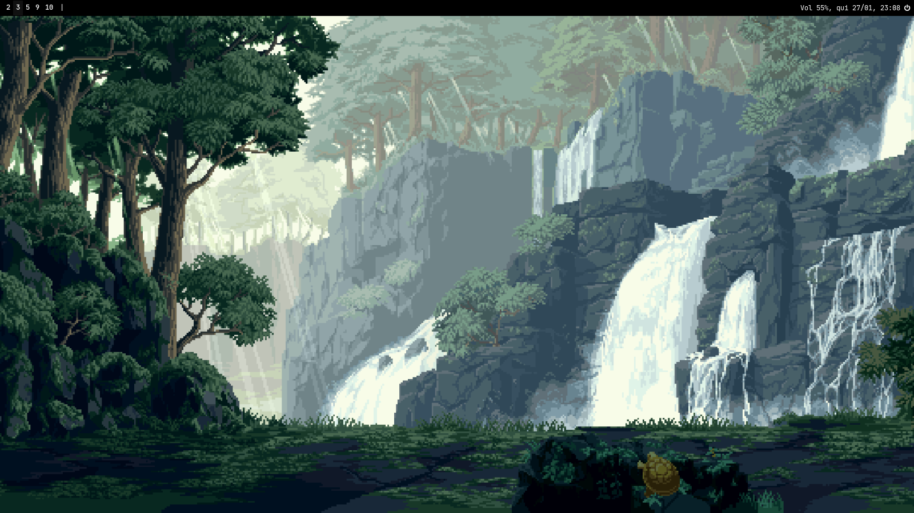
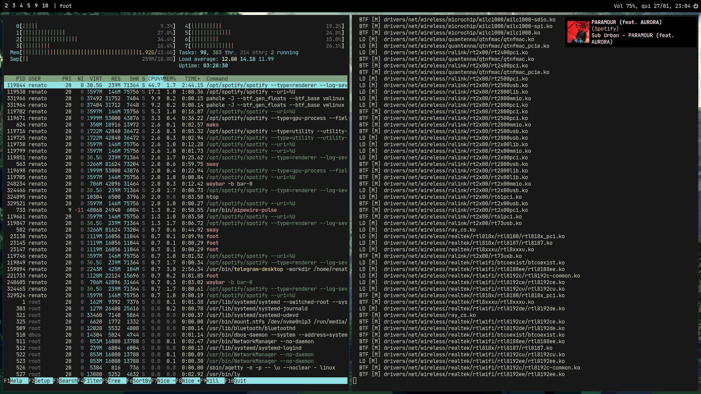
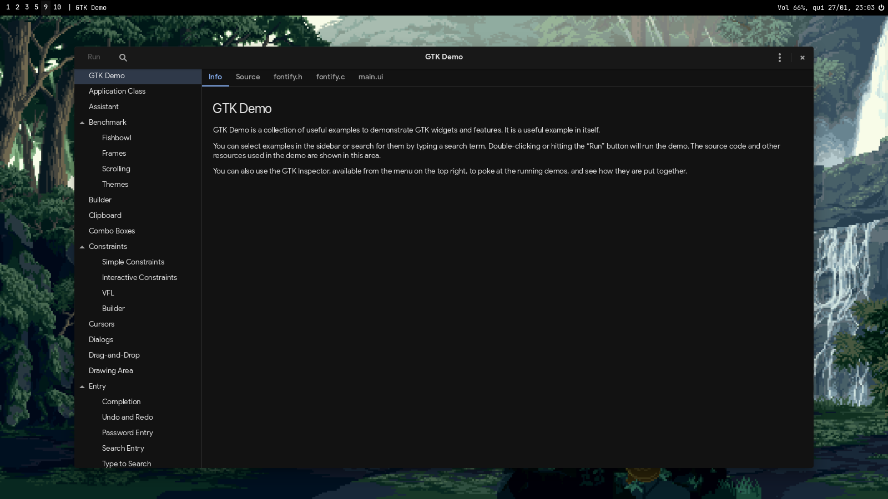

# Dotfiles.
All my dotfiles, blah blah.

### Info

- **OS:** Arch Linux
- **WM:** Sway
- **Bar:** Waybar
- **GTK Theme:** DarkerMateria

### Notes

(btw I use yay) To install the packages use this command:`yay -S - < packages.txt`

### Quick Preview

